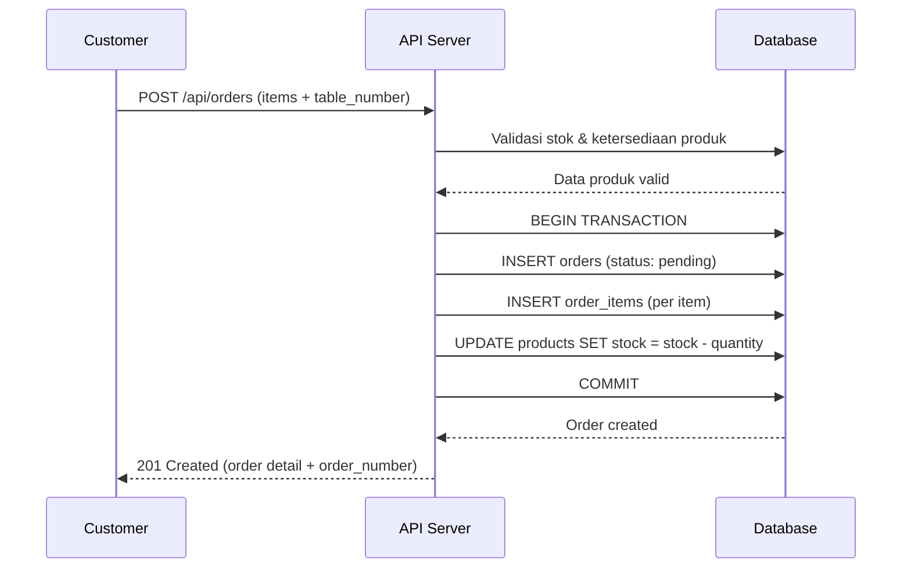
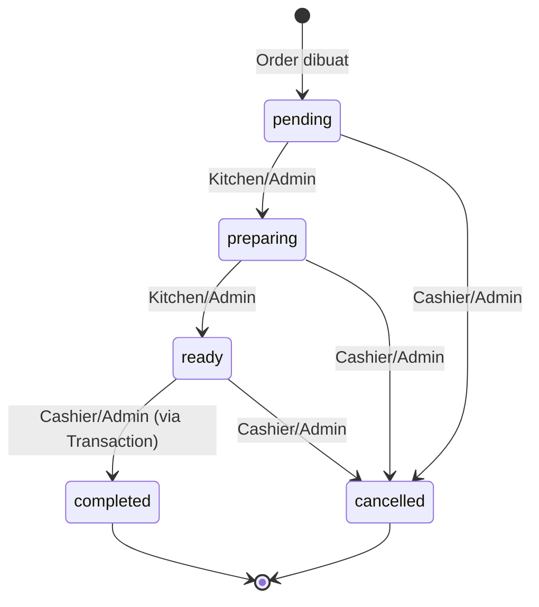
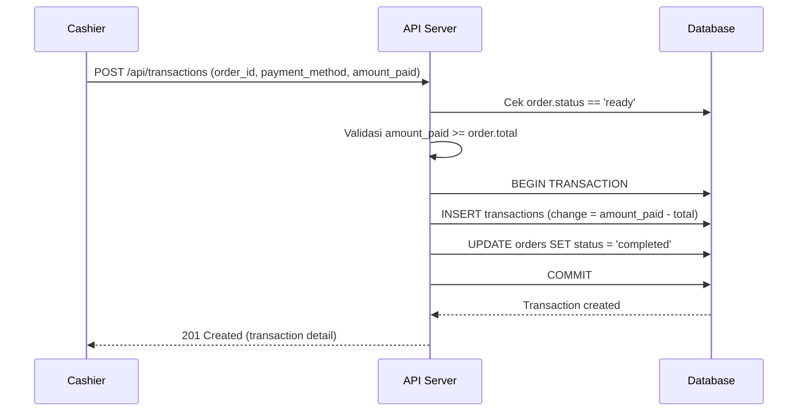

# SelfOrderSystem Backend v1.0

Backend API untuk aplikasi **Self-Order Restoran** berbasis Laravel. Sistem ini menangani seluruh alur pemesanan makanan secara mandiri oleh pelanggan, mulai dari manajemen menu, pembuatan order, pemrosesan pembayaran, hingga pelaporan penjualan untuk admin.

---

## Deskripsi Singkat

SelfOrderSystem adalah RESTful API backend yang dirancang untuk restoran F&B dengan konsep self-ordering. Sistem ini mendukung 4 role pengguna (**Admin**, **Cashier**, **Kitchen**, **Customer**) dengan kontrol akses granular menggunakan Policy dan Gate.

**Fungsionalitas utama:**
- **Autentikasi** — Register, Login, Logout berbasis token (Laravel Sanctum)
- **Manajemen Menu** — CRUD kategori dan produk dengan upload gambar
- **Pemesanan** — Pembuatan order, validasi stok, penghitungan total otomatis, auto-generate nomor order
- **Alur Status Order** — `pending → preparing → ready → completed` dengan validasi transisi per role
- **Pembayaran (Transaksi)** — Pencatatan pembayaran, validasi nominal, penghitungan kembalian otomatis
- **Pelaporan** — Laporan penjualan harian/mingguan/bulanan, produk terlaris, dan stok rendah (dengan fitur Export PDF via DomPDF)

**Arsitektur:**
- Pattern: **MVC** (Model-View-Controller) tanpa View (API-only)
- Auth: **Token-based** via Laravel Sanctum
- Authorization: **Policy-based** per resource + **Gate** untuk reporting
- Response Format: Standar via `ApiResponseTrait`
- Error Handling: Global exception handler via `Handler.php`

---

## Prasyarat / Requirements

| Komponen        | Versi                |
|-----------------|----------------------|
| PHP             | >= 8.3               |
| Laravel         | 13.x                |
| MySQL           | 8.x                 |
| Composer        | 2.x                 |
| Node.js         | 18.x (untuk asset)  |
| Laravel Sanctum | 4.x                 |
| Pest (Testing)  | 4.x                 |
| DomPDF (Laravel)| 3.x                 |

---

## Struktur Direktori

```
SelfOrderSystem/
├── app/
│   ├── ApiResponseTrait.php          # Trait standar format response API
│   ├── Exceptions/
│   │   └── Handler.php               # Global exception handler
│   ├── Helper/                       # Helper functions
│   ├── Http/
│   │   ├── Controllers/
│   │   │   ├── Controller.php        # Base controller (import ApiResponseTrait)
│   │   │   ├── OrderController.php   # CRUD & status update order
│   │   │   ├── TransactionController.php  # Pembayaran order
│   │   │   ├── Admin/
│   │   │   │   ├── CategoryController.php # CRUD kategori
│   │   │   │   ├── ProductController.php  # CRUD produk + upload gambar
│   │   │   │   └── ReportController.php   # Laporan penjualan & stok
│   │   │   └── Auth/
│   │   │       └── AuthController.php     # Register, Login, Logout
│   │   └── Middleware/
│   │       └── RoleMiddleware.php    # Middleware cek role pengguna
│   ├── Models/
│   │   ├── User.php                  # Model user + relasi orders, transactions
│   │   ├── Categories.php            # Model kategori + relasi products
│   │   ├── Products.php              # Model produk + relasi category, orderItems
│   │   ├── Orders.php                # Model order + generateOrderNumber()
│   │   ├── OrderItems.php            # Model item per order (pivot)
│   │   └── Transactions.php          # Model transaksi pembayaran
│   ├── Policies/
│   │   ├── CategoriesPolicy.php      # Otorisasi akses kategori
│   │   ├── ProductsPolicy.php        # Otorisasi akses produk
│   │   ├── OrdersPolicy.php          # Otorisasi akses order
│   │   └── TransactionsPolicy.php    # Otorisasi akses transaksi
│   └── Providers/
│       └── AppServiceProvider.php    # Gate 'view-reports' untuk laporan
├── bootstrap/
│   └── app.php                       # Konfigurasi app, middleware, exception
├── database/
│   └── migrations/                   # Skema tabel database
├── routes/
│   └── api.php                       # Definisi seluruh endpoint API
├── tests/                            # Unit & feature test (Pest)
├── .env.example                      # Template environment
└── composer.json                     # Dependencies PHP
```

---

## Instalasi dan Setup

```bash
# 1. Clone repository
git clone <repository-url>
cd SelfOrderSystem

# 2. Install dependencies PHP
composer install

# 3. Salin file environment
cp .env.example .env

# 4. Generate application key
php artisan key:generate

# 5. Konfigurasi database di file .env (lihat bagian Konfigurasi Environment)

# 6. Jalankan migrasi database
php artisan migrate

# 7. (Opsional) Jalankan seeder jika tersedia
php artisan db:seed

# 8. Buat symbolic link untuk storage (upload gambar produk)
php artisan storage:link

# 9. Jalankan development server
php artisan serve
```

Server akan berjalan di `http://localhost:8000`.

---

## Konfigurasi Environment

Variabel `.env` yang perlu dikonfigurasi:

| Variabel           | Default              | Keterangan                                   |
|--------------------|----------------------|----------------------------------------------|
| `APP_NAME`         | `Laravel`            | Nama aplikasi                                |
| `APP_ENV`          | `local`              | Environment: `local`, `staging`, `production` |
| `APP_DEBUG`        | `true`               | Mode debug (tampilkan detail error)          |
| `APP_URL`          | `http://localhost`   | Base URL aplikasi                            |
| `DB_CONNECTION`    | `mysql`              | Driver database                              |
| `DB_HOST`          | `127.0.0.1`          | Host database                                |
| `DB_PORT`          | `3306`               | Port database                                |
| `DB_DATABASE`      | `selfordersystem`    | Nama database                                |
| `DB_USERNAME`      | `root`               | Username database                            |
| `DB_PASSWORD`      | *(kosong)*           | Password database                            |
| `FILESYSTEM_DISK`  | `local`              | Disk penyimpanan file (upload gambar)         |

> **Catatan:** Untuk production, pastikan `APP_DEBUG=false` agar detail error internal tidak terekspos ke client.

---

## Endpoint API / Routes

Semua endpoint memiliki prefix `/api`. Endpoint yang memerlukan autentikasi ditandai dengan 🔒.

### Authentication

| Method | URL                   | Deskripsi            | Body                                               | Response     |
|--------|-----------------------|----------------------|-----------------------------------------------------|--------------|
| POST   | `/api/auth/register`  | Registrasi user baru | `name`, `email`, `password`, `password_confirmation` | 201 Created  |
| POST   | `/api/auth/login`     | Login user           | `email`, `password`                                  | 200 OK       |
| POST   | `/api/auth/logout` 🔒 | Logout user          | —                                                    | 200 OK       |

### Categories 🔒

| Method | URL                        | Deskripsi             | Params / Body                | Access          |
|--------|----------------------------|-----------------------|------------------------------|-----------------|
| GET    | `/api/categories`          | List kategori         | `?name=`, `?limit=10`        | Semua role      |
| POST   | `/api/categories`          | Buat kategori baru    | `name`                       | Admin           |
| GET    | `/api/categories/{id}`     | Detail kategori       | —                            | Semua role      |
| PUT    | `/api/categories/{id}`     | Update kategori       | `name`                       | Admin           |
| DELETE | `/api/categories/{id}`     | Hapus kategori        | —                            | Admin           |

### Products 🔒

| Method | URL                      | Deskripsi           | Params / Body                                                       | Access     |
|--------|--------------------------|---------------------|----------------------------------------------------------------------|------------|
| GET    | `/api/products`          | List produk         | `?category_id=`, `?search=`, `?status=`, `?limit=10`                | Semua role |
| POST   | `/api/products`          | Buat produk baru    | `category_id`, `name`, `description`, `price`, `stock`, `image`, `status` | Admin      |
| GET    | `/api/products/{id}`     | Detail produk       | —                                                                    | Semua role |
| PUT    | `/api/products/{id}`     | Update produk       | (sama seperti create, semua opsional)                                | Admin      |
| DELETE | `/api/products/{id}`     | Hapus produk        | —                                                                    | Admin      |

### Orders 🔒

| Method | URL                            | Deskripsi           | Params / Body                                           | Access                      |
|--------|--------------------------------|---------------------|---------------------------------------------------------|-----------------------------|
| GET    | `/api/orders`                  | List orders         | `?status=`, `?date=YYYY-MM-DD`, `?limit=10`             | Admin, Cashier, Kitchen, Customer (own) |
| POST   | `/api/orders`                  | Buat order baru     | `table_number`, `notes`, `items[{product_id, quantity, notes}]` | Admin, Cashier, Customer    |
| GET    | `/api/orders/{id}`             | Detail order        | —                                                        | Admin, Cashier, Kitchen, Customer (own) |
| PATCH  | `/api/orders/{id}/status`      | Update status order | `status`                                                 | Admin, Cashier, Kitchen     |

**Contoh Request — Buat Order:**
```json
{
  "table_number": 5,
  "notes": "Tidak pedas",
  "items": [
    { "product_id": 1, "quantity": 2, "notes": "Extra cheese" },
    { "product_id": 3, "quantity": 1, "notes": null }
  ]
}
```

**Contoh Response — 201 Created:**
```json
{
  "success": true,
  "message": "Data has been successfully created.",
  "data": {
    "id": 1,
    "order_number": "ORD-20260523-0001",
    "table_number": 5,
    "status": "pending",
    "notes": "Tidak pedas",
    "items": [
      { "id": 1, "product_id": 1, "name": "Nasi Goreng", "quantity": 2, "price": 25000, "notes": "Extra cheese" },
      { "id": 2, "product_id": 3, "name": "Iced Tea", "quantity": 1, "price": 8000, "notes": null }
    ],
    "total": 58000,
    "created_at": "2026-05-23T10:30:00Z"
  }
}
```

### Transactions 🔒

| Method | URL                  | Deskripsi           | Params / Body                                    | Access         |
|--------|----------------------|---------------------|--------------------------------------------------|----------------|
| GET    | `/api/transactions`  | List transaksi      | `?start_date=`, `?end_date=`, `?payment_method=`, `?limit=10` | Admin, Cashier |
| POST   | `/api/transactions`  | Buat pembayaran     | `order_id`, `payment_method`, `amount_paid`       | Admin, Cashier |

**Contoh Request — Buat Transaksi:**
```json
{
  "order_id": 1,
  "payment_method": "cash",
  "amount_paid": 100000
}
```

**Contoh Response — 201 Created:**
```json
{
  "success": true,
  "message": "Data has been successfully created.",
  "data": {
    "id": 1,
    "order_id": 1,
    "order_number": "ORD-20260523-0001",
    "payment_method": "cash",
    "amount_paid": 100000,
    "change": 42000,
    "total": 58000,
    "processed_by": { "id": 2, "name": "Cashier A" },
    "created_at": "2026-05-23T10:40:00Z"
  }
}
```

### Reports 🔒 (Admin Only)

| Method | URL                          | Deskripsi                  | Params                                                    |
|--------|------------------------------|----------------------------|------------------------------------------------------------|
| GET    | `/api/reports/sales`         | Laporan penjualan          | `?start_date=`, `?end_date=`, `?group_by=daily\|weekly\|monthly` |
| GET    | `/api/reports/top-products`  | Produk terlaris            | `?start_date=`, `?end_date=`, `?limit=10`                  |
| GET    | `/api/reports/low-stock`     | Produk stok rendah         | `?threshold=10`, `?limit=10`                                |
| GET    | `/api/reports/sales/export`  | Export Laporan penjualan   | `?start_date=`, `?end_date=`, `?group_by=daily\|weekly\|monthly` |
| GET    | `/api/reports/top-products/export` | Export Produk terlaris | `?start_date=`, `?end_date=`                         |
| GET    | `/api/reports/low-stock/export` | Export Produk stok rendah| `?threshold=10`                                           |

> **Catatan:** Endpoint dengan akhiran `/export` akan langsung mengunduh file PDF hasil generate DomPDF (maksimal 500 baris data).

**Contoh Response — Sales Report:**
```json
{
  "success": true,
  "message": "sales report data is available.",
  "data": {
    "summary": {
      "total_revenue": 5250000,
      "total_orders": 85,
      "avg_order_value": 61765
    },
    "breakdown": [
      { "date": "2026-05-23", "revenue": 890000, "orders": 14 },
      { "date": "2026-05-22", "revenue": 750000, "orders": 12 }
    ]
  }
}
```

---

## Authentication & Authorization

### Mekanisme Autentikasi

Aplikasi menggunakan **Laravel Sanctum** (token-based authentication):

1. User memanggil `POST /api/auth/login` dengan `email` dan `password`.
2. Server memvalidasi kredensial dan mengembalikan **Bearer Token**.
3. Semua request ke endpoint yang dilindungi harus menyertakan header:
   ```
   Authorization: Bearer <token>
   ```
4. Untuk logout, `POST /api/auth/logout` akan menghapus (revoke) token yang sedang aktif.

### Mekanisme Otorisasi

Otorisasi menggunakan kombinasi **Policy**, **Gate**, dan **Middleware**:

| Mekanisme    | File                         | Keterangan                                     |
|-------------|------------------------------|-------------------------------------------------|
| Policy      | `CategoriesPolicy.php`       | CRUD kategori — read: semua, write: admin       |
| Policy      | `ProductsPolicy.php`         | CRUD produk — read: semua, write: admin         |
| Policy      | `OrdersPolicy.php`           | Order — create: admin/cashier/customer, status update: admin/cashier/kitchen |
| Policy      | `TransactionsPolicy.php`     | Transaksi — create & read: admin/cashier only   |
| Gate        | `view-reports`               | Laporan — admin only                            |
| Middleware  | `RoleMiddleware.php`         | Middleware reusable cek role pengguna            |

### Permission Matrix

| Resource             | Admin | Cashier | Kitchen | Customer |
|----------------------|:-----:|:-------:|:-------:|:--------:|
| Categories CRUD      |  ✅   |   R     |    R    |    R     |
| Products CRUD        |  ✅   |   R     |    R    |    R     |
| Orders Create        |  ✅   |   ✅    |   ❌    |    ✅    |
| Orders Read All      |  ✅   |   ✅    |   ✅    |   ❌ (own only) |
| Orders Update Status |  ✅   |   ✅    |   ✅    |    ❌    |
| Transactions Create  |  ✅   |   ✅    |   ❌    |    ❌    |
| Transactions Read    |  ✅   |   ✅    |   ❌    |    ❌    |
| Reports              |  ✅   |   ❌    |   ❌    |    ❌    |

### Transisi Status Order per Role

| Dari → Ke               | Cashier | Kitchen | Admin |
|--------------------------|:-------:|:-------:|:-----:|
| pending → preparing      |   ❌    |   ✅    |  ✅   |
| preparing → ready        |   ❌    |   ✅    |  ✅   |
| ready → completed        |   ✅    |   ❌    |  ✅   |
| any → cancelled          |   ✅    |   ❌    |  ✅   |

---

## Database Schema

### Entity Relationship Diagram

```mermaid
erDiagram
    users ||--o{ orders : "places"
    users ||--o{ transactions : "processed_by"
    categories ||--o{ products : "has"
    orders ||--o{ order_items : "contains"
    products ||--o{ order_items : "included_in"
    orders ||--|| transactions : "paid_via"

    users {
        bigint id PK
        string name
        string email UK
        string password
        enum role "admin|cashier|kitchen|customer"
        timestamp created_at
        timestamp updated_at
    }

    categories {
        bigint id PK
        string name UK
        string slug UK
        timestamp created_at
        timestamp updated_at
        timestamp deleted_at "soft delete"
    }

    products {
        bigint id PK
        bigint category_id FK
        string name
        text description
        decimal price "10,2"
        integer stock
        string image
        enum status "available|unavailable"
        timestamp created_at
        timestamp updated_at
        timestamp deleted_at "soft delete"
    }

    orders {
        bigint id PK
        bigint user_id FK
        string order_number UK "ORD-YYYYMMDD-XXXX"
        integer table_number
        enum status "pending|preparing|ready|completed|cancelled"
        decimal total "12,2"
        text notes
        timestamp created_at
        timestamp updated_at
    }

    order_items {
        bigint id PK
        bigint order_id FK
        bigint product_id FK
        integer quantity
        decimal price "10,2"
        string notes
    }

    transactions {
        bigint id PK
        bigint order_id FK_UK
        enum payment_method "cash|card|qris"
        decimal amount_paid "12,2"
        decimal change "12,2"
        bigint processed_by FK
        timestamp created_at
    }
```

### Relasi antar Tabel

```
users (1) ──── (N) orders
users (1) ──── (N) transactions [processed_by]
categories (1) ──── (N) products
orders (1) ──── (N) order_items
products (1) ──── (N) order_items
orders (1) ──── (1) transactions
```

---

## Fitur Utama / Modul

### 1. Modul Autentikasi (`AuthController`)
- Registrasi user baru dengan role default `customer`
- Login menghasilkan personal access token (Sanctum)
- Logout menghapus token aktif
- Password di-hash menggunakan Bcrypt

### 2. Modul Kategori (`CategoryController`)
- CRUD lengkap dengan soft delete
- Slug otomatis di-generate dari nama kategori
- Filter pencarian berdasarkan nama
- Paginasi response

### 3. Modul Produk (`ProductController`)
- CRUD lengkap dengan soft delete
- Upload gambar produk ke disk `public`
- Penggantian gambar otomatis menghapus file lama
- Filter berdasarkan: `category_id`, `search` (nama), `status`
- Eager loading relasi `category`

### 4. Modul Order (`OrderController`)
- **Pembuatan order:**
  - Validasi ketersediaan produk (`status = available`)
  - Validasi kecukupan stok
  - Penghitungan total otomatis: `Σ(price × quantity)`
  - Auto-generate nomor order: `ORD-YYYYMMDD-XXXX`
  - Pengurangan stok otomatis dalam DB transaction
- **Listing:**
  - Filter berdasarkan `status` dan `date`
  - Customer hanya melihat order miliknya sendiri
- **Update status:**
  - Validasi transisi berdasarkan role (lihat tabel di atas)
  - Menggunakan konstanta `STATUS_TRANSITIONS`

### 5. Modul Transaksi (`TransactionController`)
- **Pembayaran order:**
  - Order harus berstatus `ready`
  - `amount_paid` harus ≥ `total` order
  - Hitung kembalian otomatis: `change = amount_paid - total`
  - Status order otomatis berubah ke `completed`
  - Mencatat siapa yang memproses (`processed_by`)
- **Listing transaksi:**
  - Filter berdasarkan rentang waktu dan metode pembayaran
  - Eager loading relasi `order` dan `processor`

### 6. Modul Laporan (`ReportController`)
- **Sales Report:**
  - Summary: `total_revenue`, `total_orders`, `avg_order_value`
  - Breakdown per hari/minggu/bulan menggunakan `DATE_FORMAT()`
  - Hanya menghitung order berstatus `completed`
- **Top Products:**
  - Agregasi penjualan per produk (quantity terjual & revenue)
  - Join tabel `products`, `order_items`, `orders`
- **Low Stock:**
  - Produk dengan stok ≤ threshold (default 10)
- **Export PDF:**
  - Mendukung ekspor ke PDF untuk ketiga jenis laporan di atas menggunakan library `barryvdh/laravel-dompdf`.
  - Terdapat hard-limit maksimal 500 data yang di-generate per request PDF untuk mencegah memory exhaustion.
  - Memiliki view khusus (`sales.blade.php`, `top-products.blade.php`, `low-stock.blade.php`) di direktori `resources/views/reports`.

---

## Alur Kerja / Workflow

### Alur Pemesanan (Order Flow)



### Alur Status Order



### Alur Pembayaran (Transaction Flow)



### Arsitektur Request-Response

```
Client Request
    │
    ▼
[routes/api.php] ── Route matching
    │
    ▼
[Middleware] ── auth:sanctum (token verification)
    │
    ▼
[Controller] ── $this->authorize() → [Policy/Gate]
    │
    ▼
[Model / DB::table] ── Query Builder / Eloquent ORM
    │
    ▼
[ApiResponseTrait] ── Format response standar
    │
    ▼
Client Response (JSON)
```

---

## Testing

Project ini menggunakan **Pest** sebagai test runner.

```bash
# Jalankan semua test
php artisan test

# Jalankan test dengan output verbose
php artisan test --verbose

# Jalankan test tertentu
php artisan test --filter=OrderTest

# Jalankan test dengan coverage (memerlukan Xdebug/PCOV)
php artisan test --coverage
```

Lokasi file test: `tests/`

---

## Error Handling

Seluruh error pada endpoint API ditangani oleh **Global Exception Handler** (`app/Exceptions/Handler.php`) dan diformat secara konsisten menggunakan `ApiResponseTrait`.

### Format Response Error

```json
{
  "success": false,
  "message": "Deskripsi error",
  "errors": { }
}
```

### Daftar Status Code

| Code | Tipe                   | Contoh Situasi                                         |
|------|------------------------|--------------------------------------------------------|
| 400  | Bad Request            | Order belum berstatus `ready` saat membuat transaksi   |
| 401  | Unauthenticated        | Token tidak valid atau tidak disertakan                |
| 403  | Forbidden              | Role tidak memiliki izin (Policy/Gate gagal)           |
| 404  | Not Found              | Resource tidak ditemukan (ID tidak ada)                |
| 422  | Validation Error       | Input tidak lolos validasi (field required, format salah) |
| 500  | Internal Server Error  | Error tak terduga di server                            |

### Contoh Response per Status Code

**401 — Unauthenticated:**
```json
{
  "success": false,
  "message": "Unauthenticated"
}
```

**403 — Forbidden:**
```json
{
  "success": false,
  "message": "Unauthorized access"
}
```

**404 — Not Found:**
```json
{
  "success": false,
  "message": "Resource not found"
}
```

**422 — Validation Error:**
```json
{
  "success": false,
  "message": "Validation Error",
  "errors": {
    "email": ["The email field is required."],
    "password": ["The password field must be at least 8 characters."]
  }
}
```

**500 — Internal Server Error:**
```json
{
  "success": false,
  "message": "Internal Server Error"
}
```

> **Catatan:** Saat `APP_DEBUG=true`, response 500 akan menampilkan pesan error detail. Pada production (`APP_DEBUG=false`), pesan diganti menjadi `"Internal Server Error"` untuk keamanan.

---

## Lisensi

MIT License
